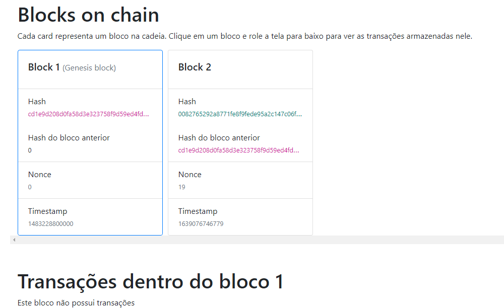
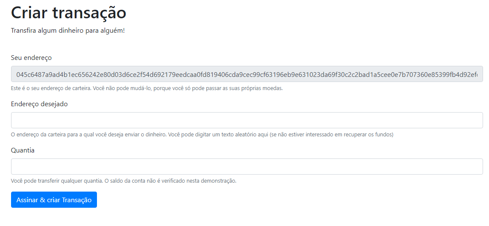
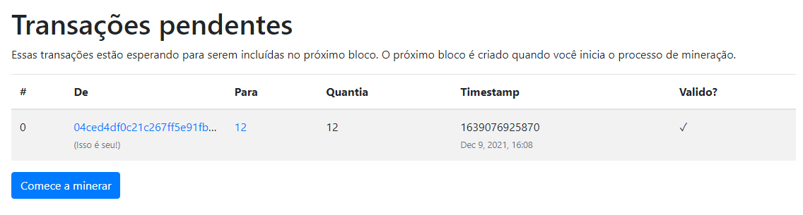

<h2 align="center">Sumilando uma blockchian Frontend</h2>

---

Aplicação angular que permite interagir com um blockchain. Você pode ver os blocos na cadeia, ver as transações dentro deles e até mesmo criar novas transações e blocos de minas.


## 🏁 Como rodar em sua maquina <a name = "getting_started"></a>
Obtenha uma cópia do front-end em sua máquina local (para brincar, testar ou desenvolver).

```
git clone https://github.com/wallaceAzevedo/simulating_blockchain_frontend.git
```

Rodar a aplicação:
```
npm start
```

Neste ponto, o aplicativo deve estar sendo executado em sua máquina em [http://localhost:4200](http://localhost:4200)


## 📸 Screenshots

 
<h3>Home page:</h3> 
<p>Vendo os blocos na cadeia e explorando as transações em cada bloco.</p>


---
</br>

<h3>Criando novas transações:</h3> <p>Você pode criar novas transações para qualquer carteira de qualquer valor (sem validação). Novas transações serão adicionadas às "transações pendentes", prontas para serem incluídas no próximo bloco.</p>


---
</br>

<h3>Transações pendentes:</h3> 
<p> Lista de todas as transações pendentes. Eles serão incluídos no próximo bloco quando o processo de mineração começar.</p>


---
</br>
⚠️Isso é apenas para fins educacionais. Isso não é de forma alguma uma implementação de blockchain completa (nem pretende ser uma). Use-o para aprender como os blockchains funcionam.